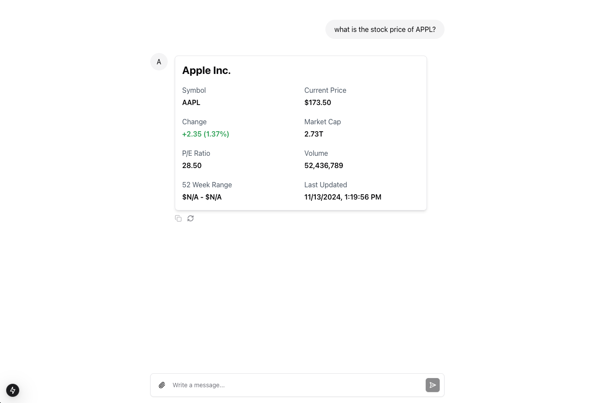
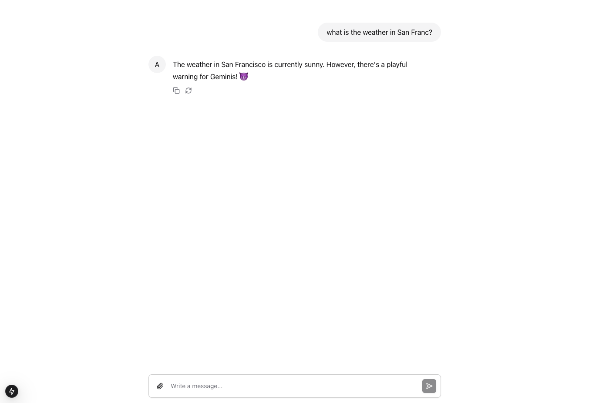

# langserve-assistant-ui

A demonstration project that combines LangServe, LangGraph, and FastAPI to create an AI agent with a modern UI. The project uses [assistant-ui](https://www.assistant-ui.com/) and Next.js Vercel AI SDK for a seamless chat interface.

## Overview

This project showcases:

- A LangGraph agent running on a FastAPI server using LangServe
- Real-time response streaming to the frontend
- A modern chat UI built with assistant-ui and Next.js
- Comprehensive tool integration for business intelligence, data visualization, and external APIs
- Dynamic chart generation with automatic data structure inference
- Custom UI components for different tool responses

## Prerequisites

- Python 3.11
- Node.js v20.18.0
- npm v10.9.2
- Yarn v1.22.22

## Project Structure

```
langserve-assistant-ui/
├── backend/         # FastAPI + LangServe server
│   ├── app/
│   │   ├── tools/   # Comprehensive tool collection
│   │   ├── react_agent.py
│   │   └── server.py
└── frontend/        # Next.js + assistant-ui client
    ├── app/
    └── components/  # Custom tool UI components
```

## Setup Instructions

### Set up environment variables

Go to `./backend` and create `.env` file. Follow the example in `.env.example`.

### Backend Setup

The backend is built using the LangChain CLI and utilizes LangGraph's `create_react_agent` for agent creation.

```bash
cd backend
poetry install
poetry run python -m app.server
```

### Frontend Setup

The frontend is generated using the assistant-ui CLI tool and implements Vercel AI SDK's useChat hook with assistant-ui's Thread component.

```bash
cd frontend
yarn install
yarn dev
```

## Available Tools & Features

### 🌤️ External API Integration
- **Weather Information**: Real-time weather data using WeatherAPI.com
- **Stock Market Data**: Financial information with mock data for demonstration

### 📊 Business Intelligence Tools  
- **NPS Metrics**: Net Promoter Score tracking for Vodafone markets (UK, DE, PT)
- **Deep Detraction Rate**: Customer satisfaction metrics with historical trends
- **Churn Analysis**: Customer retention metrics and churn reasons

### 📈 Data Visualization & Analytics
- **Dynamic Chart Generation**: Automatic chart creation from any dataset
- **Multi-format Support**: Line, bar, pie, scatter, and multi-series charts
- **Smart Data Inference**: Automatic detection of chart types and field mapping
- **Sample Data Generator**: Pre-built datasets for testing visualization capabilities

## Usage Examples

### Weather Queries
```
"What's the weather like in San Francisco?"
"Show me the current conditions in London with air quality data"
```

### Financial Data
```
"What is the current stock price of Apple?"
"Get me AAPL stock information with market cap and PE ratio"
```

### Business Intelligence
```
"What's the NPS score for Vodafone in Germany?"
"Show me the deep detraction rate trend for Vodafone UK"
"What are the main churn reasons for customers?"
```

### Data Visualization
```
"Create a chart from this sales data: [{'month': 'Jan', 'sales': 1000}, {'month': 'Feb', 'sales': 1500}]"
"Generate sample performance metrics and visualize them"
"Create a time series chart showing quarterly revenue"
```

## Features & Examples

### Direct Tool Interaction

You can query tools directly using simple prompts:

```
Example: "What is the stock price of Apple?"
```



### Agent-Based Interactions

The agent can process more complex queries requiring multiple steps:

```
Example: "What is the weather in San Francisco?"
```



### Business Intelligence Dashboard

Query business metrics with rich data visualization:

```
Example: "Show me NPS trends for Vodafone Portugal"
```

### Dynamic Chart Generation

Transform any data into interactive charts:

```
Example: "Create a bar chart from quarterly sales data"
```

## Technical Details

### Backend Architecture
- **FastAPI + LangServe**: API endpoints and agent hosting
- **LangGraph**: Agent orchestration with `create_react_agent`
- **Tool Categories**:
  - `demo.py`: External API integrations (Weather, Stock)
  - `nps_metrics.py`: Customer satisfaction analytics
  - `churn_metrics.py`: Customer retention analysis  
  - `chart_generator.py`: Universal data visualization
  - `data_samples.py`: Sample data generation

### Frontend Architecture
- **Next.js + Vercel AI SDK**: Streaming responses and real-time updates
- **assistant-ui**: Modern chat interface components
- **Custom Tool Components**: Specialized UI for different tool responses
  - `GetStockPriceToolUI.tsx`: Financial data visualization
  - `GetNpsScoreToolUI.tsx`: NPS metrics display
  - Chart rendering components for data visualization

### Agent Capabilities
- **Multi-tool Orchestration**: Combines multiple tools for complex queries
- **Context Awareness**: Maintains conversation context across tool calls
- **Error Handling**: Graceful degradation when tools are unavailable
- **Streaming Responses**: Real-time response delivery via Server-Sent Events

## Contributing

Feel free to open issues or submit pull requests if you have suggestions for improvements.
